<div align="center">



</div>

> **30-second scan:** I'm Ahmed Gamal (Snow) - an AI engineer building
> citation-grounded RAG and agent systems: cited answers or safe refusal,
> never a confident guess.
> Proof first: [**Occlusion**](https://github.com/0xSnow-1/Occlusion)
> - Ragas faithfulness 0.9304, Harbor safety trilogy 204/204, 100 offline
> tests green, honest backlog documented.
> Open to AI Engineer roles, remote or on-site.

<details>
<summary><b>Static ASCII fallback (neofetch)</b> - same intro, no animation</summary>

```
┌─────────────────────────────────────────────────────────────┐
│  ahmed@snow ~ % whoami                                      │
├─────────────────────────────────────────────────────────────┤
│  NAME       : Ahmed Gamal                                   │
│  ROLE       : AI Engineer                                   │
│  FOCUS      : Agentic RAG · Evaluation · Guardrails         │
│  STACK      : LangGraph · Qdrant (hybrid + RRF) · Ragas     │
│              · Pydantic v2 · Python 3.12+                   │
│  LANGUAGES  : English · Arabic (native)                     │
│  PRIOR LIFE : Smart-contract security researcher            │
│  CURRENT    : Occlusion — citation-grounded dental FAQ      │
│  CONTACT    : 0xahmed.gamal@gmail.com                       │
└─────────────────────────────────────────────────────────────┘
```

</details>

---

### Currently building

[**Occlusion**](https://github.com/0xSnow-1/Occlusion)
- a citation-grounded dental patient FAQ assistant over an openly licensed
corpus (HRSA/NIDCR/CDC public domain + NHS UK OGL v3.0). Routine questions
get answers with inline citations verified against retrieved chunks;
diagnostic, prescriptive, or out-of-corpus questions hit a deterministic
pre-LLM guardrail and fail-closed validation gates - the LLM is never even
called on refusals.

`0.9304 faithfulness` · `0.8938 relevancy` · `0.7952 precision` · `0.9191 recall`
- Ragas baseline v1, 78-item golden set, judge model distinct from generator.
`204/204` Harbor safety criteria across trap-refusal, boundary-precision,
and near-miss suites. `100` offline tests green. Live-model pass 192/202,
with the 10 boundary over-refusals logged as an open calibration backlog,
not hidden.

Pipeline: deterministic guardrail → hybrid retrieval (Qdrant dense + sparse,
server-side RRF) → structured generation (Pydantic `Answer` vs `Refusal`)
→ fail-closed citation gates. LangSmith tracing, versioned prompts, CI on
every push.

---

### Selected work - start here

| Project | Problem → mechanism | Proof |
|---|---|---|
| [**Occlusion**](https://github.com/0xSnow-1/Occlusion) | Patient questions must never get confident guesses → pre-LLM guardrail, hybrid retrieval with RRF, Pydantic output contracts, fail-closed citation gates | Ragas 0.9304 faithfulness; 204/204 safety criteria; 100 tests green; versioned golden set + eval ledger |
| [**NutriMind**](https://github.com/0xSnow-1/NutriMind) | Meal plans drift off-goal and miss safety flags → 6-agent supervisor graph with LLM-as-judge gate and caloric-safety interrupt | Plans scoring below 7/10 auto-regenerate; 3+ days under 1200 kcal pauses for human review; LangSmith-traced |
| [**agentic-support-triage**](https://github.com/0xSnow-1/agentic-support-triage) | Support requests need deterministic routing → supervisor-routed agents with typed outputs and secured tools | Deterministic evals + LangSmith tracing |
| [**shipment-exception-triage-agent**](https://github.com/0xSnow-1/shipment-exception-triage-agent) | Entry for Single Grain Career's "Beat Claude" agentic challenge | Python |

---

### Stack

| Area | Core - shipped with | Also used |
|---|---|---|
| Orchestration | LangGraph, LangChain | — |
| Retrieval | Qdrant (hybrid dense + sparse, RRF) | FAISS |
| Parsing | PyMuPDF, Docling | — |
| Embeddings | fastembed | sentence-transformers |
| Structured output | Pydantic v2 | — |
| Serving | Streamlit, FastAPI, Docker | AG-UI |
| Data | PostgreSQL | SQLite, Supabase |
| Models | Claude (AWS Bedrock) | OpenAI, Groq, Gemini, local models |
| Eval & observability | Ragas, Harbor, LLM-as-judge, LangSmith | Hit@3 / MRR / faithfulness |
| Security | Slither, Foundry (smart-contract auditing) | — |

---

### How I work

1. **Eval before claims.** Every system ships with a benchmark and a ledger -
   scores are versioned, failures are documented, targets are explicit.
2. **Verification loops, not vibes.** Grounding is enforced by graph
   structure (guardrails, checker nodes, retry limits, escalation), not by
   prompting.
3. **Security mindset, transferred.** 2025–2026 auditing Solidity contracts
   for reentrancy and access-control bugs in competitive audits -
   "find the specific way this breaks" maps directly to LLM eval design.
4. **Built to be understood.** A year in retail sales taught me to translate
   technical complexity into terms a non-technical person can act on.

---

<div align="center">

## Socials

[](https://www.linkedin.com/in/ahmed-gamal-363b47307) [](https://x.com/0xSnowEth) [](https://instagram.com/hamido_1x) [](mailto:0xahmed.gamal@gmail.com)

Best next step: open [Occlusion](https://github.com/0xSnow-1/Occlusion)
- or reach me at `0xahmed.gamal@gmail.com`.

<picture>
  <source media="(prefers-color-scheme: dark)" srcset="https://raw.githubusercontent.com/0xSnow-1/0xSnow-1/output/github-snake-dark.svg" />
  <source media="(prefers-color-scheme: light)" srcset="https://raw.githubusercontent.com/0xSnow-1/0xSnow-1/output/github-snake.svg" />
  
</picture>

</div>
